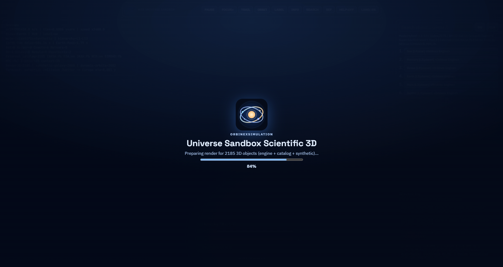
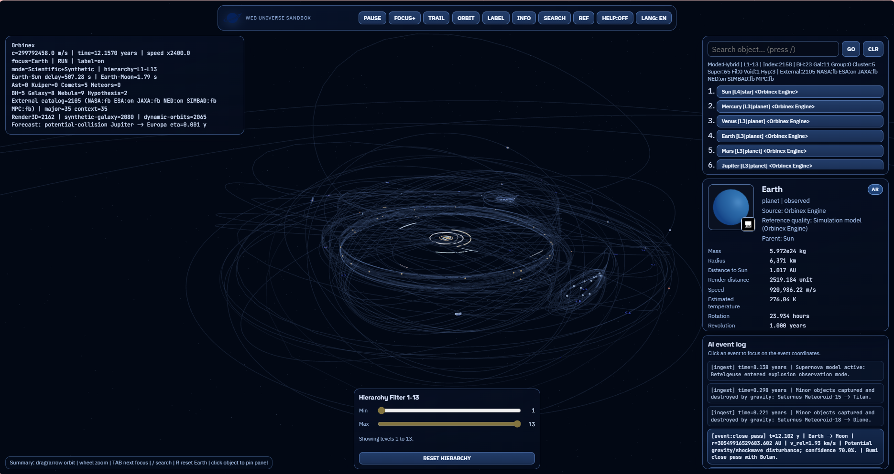
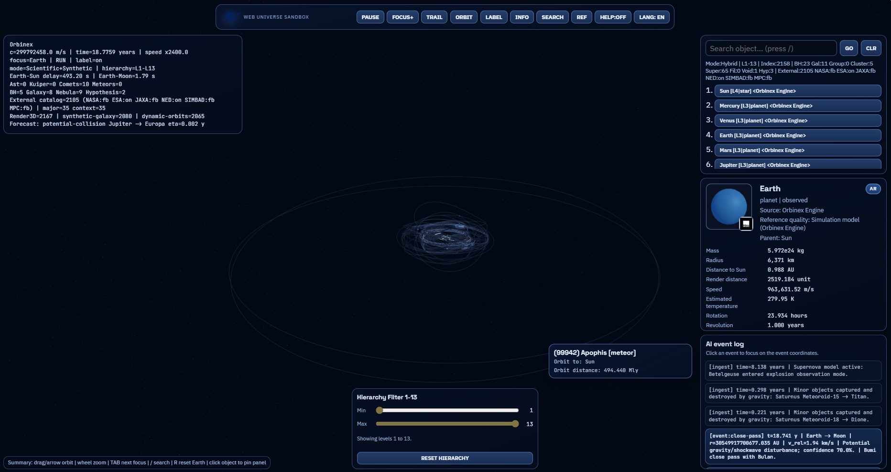
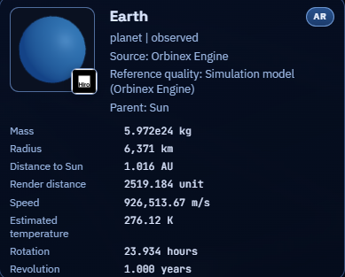
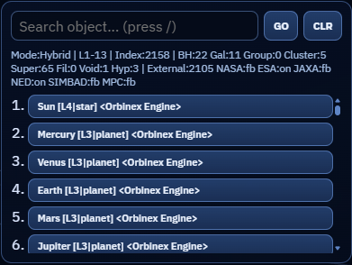
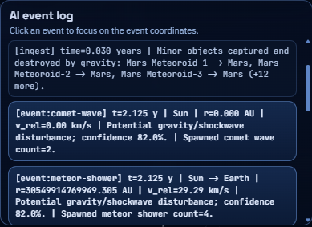
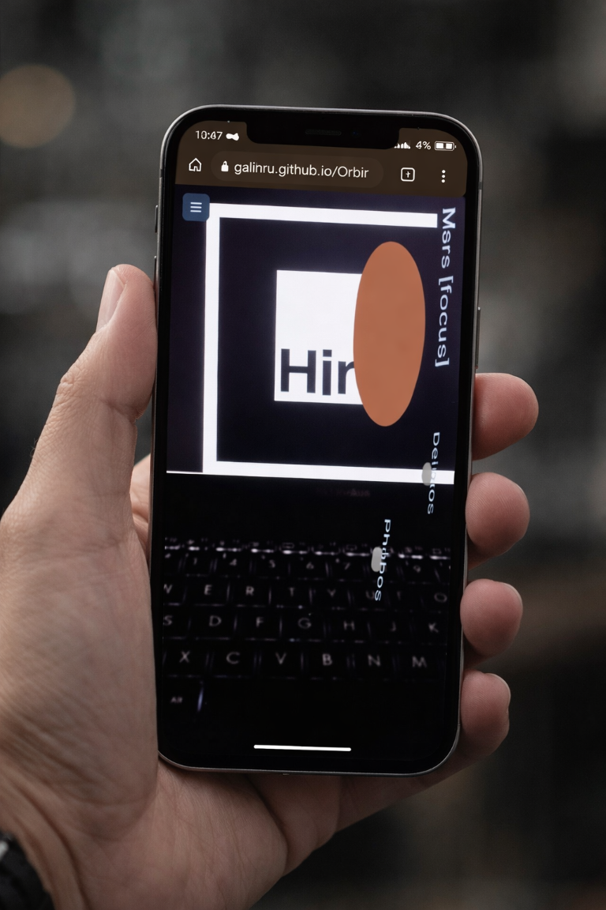
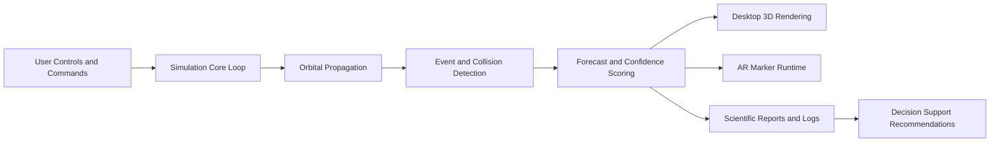
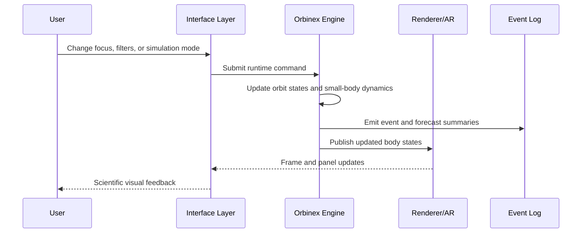

# OrbinexSimulation

[](https://github.com/galihru/OrbinexSimulation/actions/workflows/deploy-pages.yml)
[](https://galihru.github.io/OrbinexSimulation/)
[](https://www.npmjs.com/package/@galihru/orbinexsim)
[](https://www.npmjs.com/package/@galihru/orbinex)

OrbinexSimulation is a scientific 3D universe sandbox for the web. The project provides a real-time desktop simulation and a marker-based AR viewer, while keeping the physics layer reproducible through published npm modules.

## 1. Scope

This repository delivers the following capabilities:

- Real-time 3D simulation of planets, moons, dwarf planets, asteroids, Kuiper objects, comets, meteors, galaxies, clusters, and black-hole candidates.
- Event-aware simulation loop with forecasting, close-pass alerts, and recommendation output.
- Desktop and AR runtimes with shared model metadata.
- npm-consumable wrapper package in [orbinexsim-npm](orbinexsim-npm) for external integration.

## 2. Live Demo and Package Links

| Resource | Link | Purpose |
| --- | --- | --- |
| Desktop demo | [https://galihru.github.io/OrbinexSimulation/](https://galihru.github.io/OrbinexSimulation/) | Primary scientific 3D interface |
| AR viewer demo | [https://galihru.github.io/OrbinexSimulation/ar-view.html](https://galihru.github.io/OrbinexSimulation/ar-view.html) | Marker-based AR exploration |
| Wrapper package | [@galihru/orbinexsim](https://www.npmjs.com/package/@galihru/orbinexsim) | High-level integration API |
| Physics core package | [@galihru/orbinex](https://www.npmjs.com/package/@galihru/orbinex) | Orbital constants and sampling |

## 3. Empirical Runtime Screenshots and Journal-Style Interpretation

The image evidence is organized as journal-style tables. In each table, Column 1 defines the analytical focus, and Column 2 presents the observed runtime artifact.

### Table 1. Startup and Main Runtime States

| Column 1: Analytical focus | Column 2: Visual evidence |
| --- | --- |
| Startup render pipeline and object initialization stage |  |
| Global runtime overview with full orbital trace density |  |
| Focused runtime state highlighting sparse-body visibility |  |

Interpretation for Table 1:

1. Table 1, Column 2, Row 1 shows the pre-render phase where engine, catalog, and synthetic object sets are merged before interactive simulation begins.
2. Table 1, Column 2, Row 2 shows the high-density orbital regime, demonstrating concurrent rendering of major and minor bodies.
3. Table 1, Column 2, Row 3 shows the focused or sparse regime, where distant trajectories remain detectable without visual collapse.

### Table 2. Scientific UI and Diagnostics Modules

| Column 1: Analytical focus | Column 2: Visual evidence |
| --- | --- |
| Object-level scientific descriptor panel |  |
| Search and ranked object-selection panel |  |
| Event chronology and confidence stream |  |
| Hierarchy depth filtering controller |  |

Interpretation for Table 2:

1. Table 2, Column 2, Row 1 shows per-object measurable attributes, including mass, radius, distance, velocity, and rotation.
2. Table 2, Column 2, Row 2 shows deterministic retrieval of indexed bodies for fast navigation across simulation entities.
3. Table 2, Column 2, Row 3 shows event ingestion with confidence metadata, supporting temporal anomaly review.
4. Table 2, Column 2, Row 4 shows hierarchy gating for level-bounded visualization and complexity reduction.

### Table 3. AR Activation and Marker Evidence

| Column 1: Analytical focus | Column 2: Visual evidence |
| --- | --- |
| Mobile AR activation card (cross-device bridge) |  |
| Marker reference target for Hiro-based AR detection |  |
| In-situ handheld AR runtime after marker lock |  |

Interpretation for Table 3:

1. Table 3, Column 2, Row 1 shows the QR-mediated handoff used to transfer the active object context to mobile AR runtime.
2. Table 3, Column 2, Row 2 shows the canonical marker used by the AR pipeline for stable object anchoring.
3. Table 3, Column 2, Row 3 shows a real mobile capture where marker lock, label rendering, and object placement are preserved in handheld conditions without synthetic plane occlusion.

## 4. Architecture and Workflow Graph (Mermaid)





## 5. Scientific Formulation

The core equations are provided in LaTeX for scientific readability.

$$
\mu = G M
$$

$$
v = \sqrt{\frac{\mu}{r}}
$$

$$
T = 2\pi\sqrt{\frac{a^3}{\mu}}
$$

$$
\eta_{\text{years}} = \operatorname{clamp}\left(\frac{d / v_{\text{rel}}}{\text{YEAR\_SECONDS}},\ 10^{-7},\ 5000\right)
$$

$$
\text{confidence} = \operatorname{clamp}\left(0.45 + \frac{0.5}{1 + d/\text{AU}},\ 0.45,\ 0.98\right)
$$

$$
r_{\text{visual}} = \operatorname{clamp}\left((0.08 + \log_{10}(\max(r_m, 1)) \cdot 0.04) \cdot s,\ 0.03,\ 0.68\right)
$$

Plain-text fallback (for markdown engines without math rendering):

```text
mu = G * M
v = sqrt(mu / r)
T = 2 * pi * sqrt(a^3 / mu)

eta_years = clamp((distance / relative_speed) / YEAR_SECONDS, 1e-7, 5000)
confidence = clamp(0.45 + 0.5 / (1 + distance / AU), 0.45, 0.98)

r_visual = clamp((0.08 + log10(max(radius_m, 1)) * 0.04) * scale, 0.03, 0.68)
```

```mermaid
graph TD
  A[mu = G * M] --> B[v = sqrt(mu / r)]
  A --> C[T = 2 * pi * sqrt(a^3 / mu)]
  B --> D[Velocity estimate]
  C --> E[Period estimate]
  F[eta = distance / relative_speed] --> G[ETA forecast]
  H[confidence clamp] --> G
  I[log-scaled radius mapping] --> J[Stable AR object visibility]
```

| Equation | Implementation anchor | Practical role |
| --- | --- | --- |
| `mu = G * M` | [src/orbinex-compat.ts](src/orbinex-compat.ts) and [orbinexsim-npm/src/index.ts](orbinexsim-npm/src/index.ts) | Gravitational parameter for orbit calculations |
| `v = sqrt(mu / r)` | [src/orbinex-compat.ts](src/orbinex-compat.ts) | Circular velocity estimate |
| `T = 2*pi*sqrt(a^3/mu)` | [src/orbinex-compat.ts](src/orbinex-compat.ts) | Orbital period estimation |
| `eta ~= distance / speed` | [src/orbinex-compat.ts](src/orbinex-compat.ts) | Event forecast timing |
| Log-scaled AR radius mapping | [orbinexsim-npm/src/ar-runtime.ts](orbinexsim-npm/src/ar-runtime.ts) | Stable object visibility in AR |

## 6. Dependency Matrix

| Module | Category | Used in | Why it is used |
| --- | --- | --- | --- |
| [@galihru/orbinex](https://www.npmjs.com/package/@galihru/orbinex) | Physics core | App + npm wrapper | Constants and orbit sampling primitives |
| [@galihru/orbinexsim](https://www.npmjs.com/package/@galihru/orbinexsim) | Integration wrapper | External consumers | One-call desktop/AR embedding API |
| [three](https://www.npmjs.com/package/three) | Rendering | Web application | Real-time 3D scene graph and camera system |
| [qrcode](https://www.npmjs.com/package/qrcode) | Utility | Web application | AR deep-link QR generation |
| [vite](https://www.npmjs.com/package/vite) | Tooling | Build system | Development server and production bundling |

## 7. Installation, Development, and Production Runbook

### 7.1 Prerequisites

| Requirement | Recommended version | Notes |
| --- | --- | --- |
| Node.js | 20.x LTS or newer | Required for Vite 7 and modern ESM toolchain |
| npm | 10.x or newer | Default package manager in this repository |
| Git | latest stable | Required for clone, pull, and CI-compatible workflows |
| Browser | Chromium/Edge/Firefox latest | AR mode requires secure-context camera support |

### 7.2 Sequential Path (Install Module First)

Use this ordered sequence when you want the fastest path from package install to full runtime validation:

1. Install the published module in your consumer project.

```bash
npm install @galihru/orbinexsim
```

2. Clone this repository if you need direct source-level runtime customization.

```bash
git clone https://github.com/galihru/OrbinexSimulation.git
cd OrbinexSimulation
```

3. Install repository dependencies deterministically.

```bash
npm ci
```

4. Start the development runtime and validate desktop/AR entry points.

```bash
npm run dev
```

5. Build production artifacts once runtime behavior is validated.

```bash
npm run build
```

6. Build and optionally publish the wrapper package.

```bash
npm -C orbinexsim-npm run build
npm -C orbinexsim-npm pack
```

### 7.3 Fresh Installation (Deterministic)

```bash
git clone https://github.com/galihru/OrbinexSimulation.git
cd OrbinexSimulation
npm ci
```

Use `npm install` only when intentionally updating dependency resolution or lockfile state.

### 7.4 Development Runtime

```bash
npm run dev
```

Optional host/port override for LAN or device testing:

```bash
npm run dev -- --host 0.0.0.0 --port 5173
```

Catalog synchronization can be triggered explicitly:

```bash
npm run catalog:update
```

### 7.5 Production Build and Artifact Validation

```bash
npm run build
```

This command executes the full production chain:

1. `npm run catalog:update`
2. `vite build`
3. `node scripts/postbuild-optimize.mjs`

Validate production output locally:

```bash
npm run preview -- --host 0.0.0.0 --port 4173
```

The distributable output is generated in `dist/`.

### 7.6 npm Wrapper Package Build and Publish Path

```bash
npm -C orbinexsim-npm ci
npm -C orbinexsim-npm run build
npm -C orbinexsim-npm pack
```

Publish step (requires npm authentication and proper token/2FA policy):

```bash
npm -C orbinexsim-npm publish --access public
```

## 8. Using the Wrapper Module in External Projects

```ts
import { createOrbinexSim } from "@galihru/orbinexsim";

const sim = createOrbinexSim("#app", {
  mode: "desktop",
  model: "Bumi",
  autoRequestAccess: true
});

// Optional runtime switch to AR
await sim.launchAr({ camera: true, motionSensors: true });

// Scientific quick report from orbital sample
console.log(sim.buildQuickReport(1.496e11));
```

## 9. Expected Output Characteristics

| Output channel | Typical result |
| --- | --- |
| Scientific object panel | Stable physical descriptors (mass, radius, orbital distance, temperature estimate) |
| Event log | Time-indexed simulation events with confidence and relative velocity |
| Forecast section | Early warning for close-pass and potential-collision scenarios |
| AR mode | Marker-linked object rendering with runtime permission summary |

## 10. Runtime Flow (Text Graph)

```text
Input controls -> Physics update -> Orbit propagation -> Event detection
              -> Forecast scoring -> Desktop/AR rendering -> Report generation
```

## 11. Deployment

GitHub Pages deployment is handled by [deploy-pages.yml](.github/workflows/deploy-pages.yml).

1. Push to the main branch.
2. Ensure Pages source is set to GitHub Actions.
3. Wait for workflow completion in the Actions tab.

## 12. License

MIT

## 13. Author
Galih Ridho Utomo (姜瑞)
