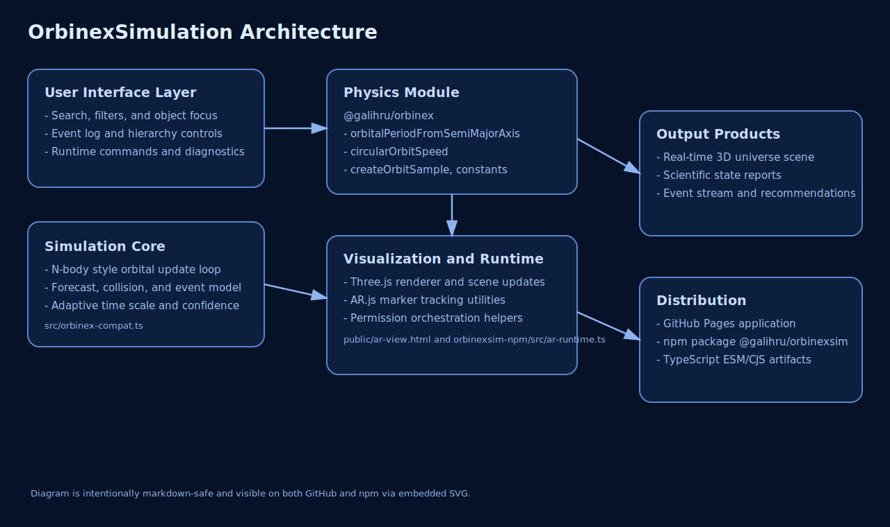
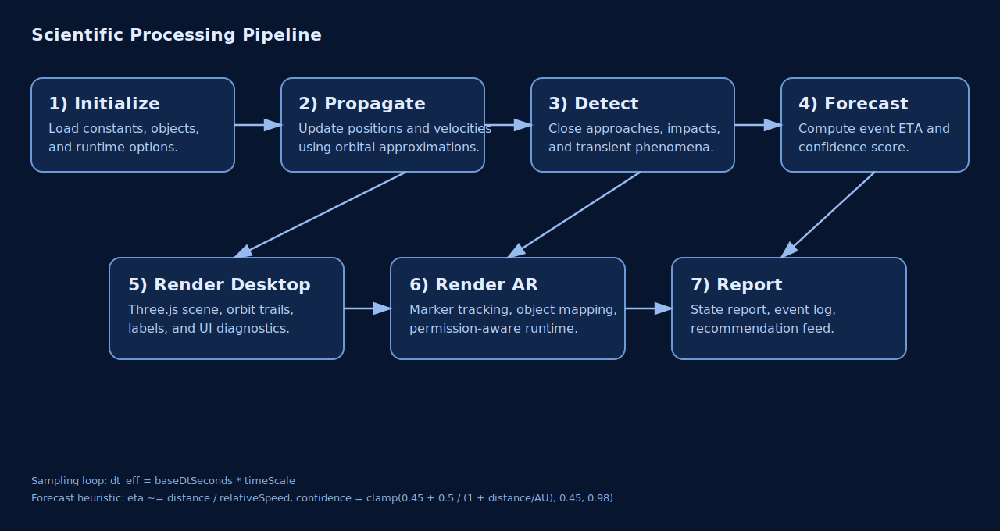
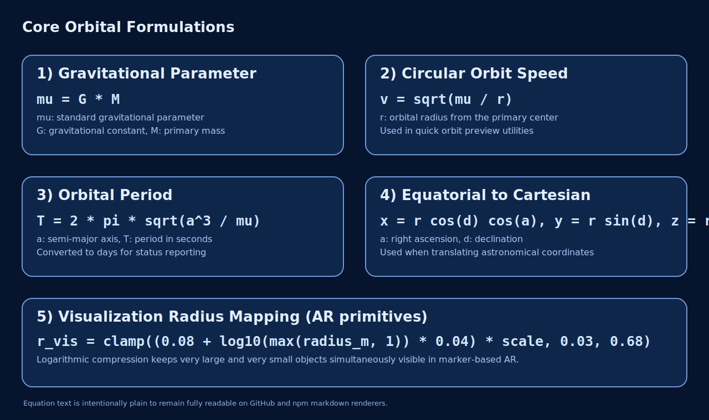

# OrbinexSimulation

[](https://github.com/galihru/OrbinexSimulation/actions/workflows/deploy-pages.yml)
[](https://galihru.github.io/OrbinexSimulation/)
[](https://www.npmjs.com/package/@galihru/orbinexsim)
[](https://www.npmjs.com/package/@galihru/orbinex)

OrbinexSimulation is a scientific 3D universe sandbox for the web. The project provides a real-time desktop simulation and a marker-based AR viewer, while keeping the physics layer reproducible through published npm modules.

## 1. Scope

This repository delivers the following capabilities:

- Real-time 3D simulation of planets, moons, dwarf planets, asteroids, Kuiper objects, comets, meteors, galaxies, clusters, and black-hole candidates.
- Event-aware simulation loop with forecasting, close-pass alerts, and recommendation output.
- Desktop and AR runtimes with shared model metadata.
- npm-consumable wrapper package in [orbinexsim-npm](orbinexsim-npm) for external integration.

## 2. Live Demo and Package Links

| Resource | Link | Purpose |
| --- | --- | --- |
| Desktop demo | [https://galihru.github.io/OrbinexSimulation/](https://galihru.github.io/OrbinexSimulation/) | Primary scientific 3D interface |
| AR viewer demo | [https://galihru.github.io/OrbinexSimulation/ar-view.html](https://galihru.github.io/OrbinexSimulation/ar-view.html) | Marker-based AR exploration |
| Wrapper package | [@galihru/orbinexsim](https://www.npmjs.com/package/@galihru/orbinexsim) | High-level integration API |
| Physics core package | [@galihru/orbinex](https://www.npmjs.com/package/@galihru/orbinex) | Orbital constants and sampling |

## 3. Architecture and Workflow





## 4. Scientific Formulation

The formulas below are written in plain-text notation for full compatibility on both GitHub and npm renderers.

```text
mu = G * M
v = sqrt(mu / r)
T = 2 * pi * sqrt(a^3 / mu)

eta_years = clamp((distance / relative_speed) / YEAR_SECONDS, 1e-7, 5000)
confidence = clamp(0.45 + 0.5 / (1 + distance / AU), 0.45, 0.98)

r_visual = clamp((0.08 + log10(max(radius_m, 1)) * 0.04) * scale, 0.03, 0.68)
```



| Equation | Implementation anchor | Practical role |
| --- | --- | --- |
| `mu = G * M` | [src/orbinex-compat.ts](src/orbinex-compat.ts) and [orbinexsim-npm/src/index.ts](orbinexsim-npm/src/index.ts) | Gravitational parameter for orbit calculations |
| `v = sqrt(mu / r)` | [src/orbinex-compat.ts](src/orbinex-compat.ts) | Circular velocity estimate |
| `T = 2*pi*sqrt(a^3/mu)` | [src/orbinex-compat.ts](src/orbinex-compat.ts) | Orbital period estimation |
| `eta ~= distance / speed` | [src/orbinex-compat.ts](src/orbinex-compat.ts) | Event forecast timing |
| Log-scaled AR radius mapping | [orbinexsim-npm/src/ar-runtime.ts](orbinexsim-npm/src/ar-runtime.ts) | Stable object visibility in AR |

## 5. Dependency Matrix

| Module | Category | Used in | Why it is used |
| --- | --- | --- | --- |
| [@galihru/orbinex](https://www.npmjs.com/package/@galihru/orbinex) | Physics core | App + npm wrapper | Constants and orbit sampling primitives |
| [@galihru/orbinexsim](https://www.npmjs.com/package/@galihru/orbinexsim) | Integration wrapper | External consumers | One-call desktop/AR embedding API |
| [three](https://www.npmjs.com/package/three) | Rendering | Web application | Real-time 3D scene graph and camera system |
| [qrcode](https://www.npmjs.com/package/qrcode) | Utility | Web application | AR deep-link QR generation |
| [vite](https://www.npmjs.com/package/vite) | Tooling | Build system | Development server and production bundling |

## 6. Installation and Local Execution

```bash
npm install
npm run dev
```

Production build and preview:

```bash
npm run build
npm run preview
```

## 7. Using the Wrapper Module in External Projects

```ts
import { createOrbinexSim } from "@galihru/orbinexsim";

const sim = createOrbinexSim("#app", {
  mode: "desktop",
  model: "Bumi",
  autoRequestAccess: true
});

// Optional runtime switch to AR
await sim.launchAr({ camera: true, motionSensors: true });

// Scientific quick report from orbital sample
console.log(sim.buildQuickReport(1.496e11));
```

## 8. Expected Output Characteristics

| Output channel | Typical result |
| --- | --- |
| Scientific object panel | Stable physical descriptors (mass, radius, orbital distance, temperature estimate) |
| Event log | Time-indexed simulation events with confidence and relative velocity |
| Forecast section | Early warning for close-pass and potential-collision scenarios |
| AR mode | Marker-linked object rendering with runtime permission summary |

## 9. Runtime Flow (Text Graph)

```text
Input controls -> Physics update -> Orbit propagation -> Event detection
              -> Forecast scoring -> Desktop/AR rendering -> Report generation
```

## 10. Deployment

GitHub Pages deployment is handled by [deploy-pages.yml](.github/workflows/deploy-pages.yml).

1. Push to the main branch.
2. Ensure Pages source is set to GitHub Actions.
3. Wait for workflow completion in the Actions tab.

## 11. License

MIT
