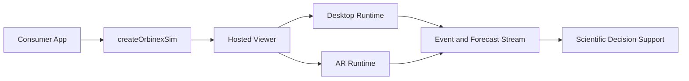
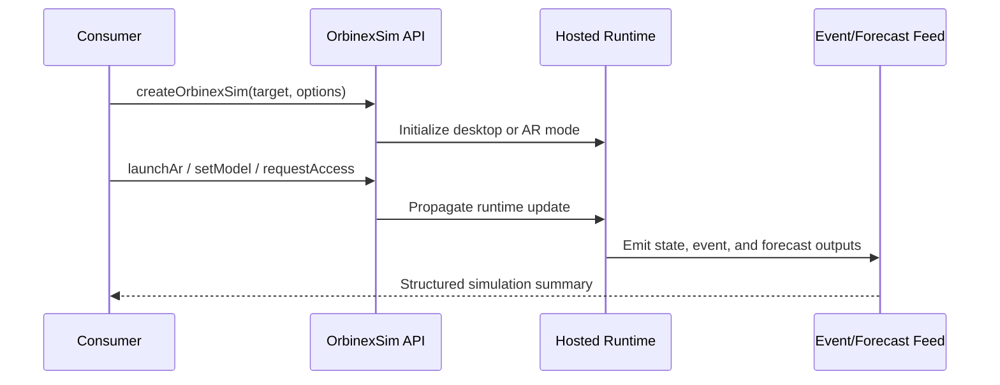

# @galihru/orbinexsim

[](https://www.npmjs.com/package/@galihru/orbinexsim)
[](https://www.npmjs.com/package/@galihru/orbinexsim)
[](https://www.npmjs.com/package/@galihru/orbinex)
[](https://galihru.github.io/OrbinexSimulation/)

High-level scientific wrapper for embedding OrbinexSimulation desktop and AR runtimes with a compact TypeScript API.

## 1. What This Module Provides

- Fast embedding of the hosted simulation viewer in desktop or AR mode.
- Runtime permission orchestration for camera, microphone, geolocation, and motion sensors.
- Orbit sample utilities backed by [@galihru/orbinex](https://www.npmjs.com/package/@galihru/orbinex).
- AR marker utilities for marker creation, tracking, catalog proxy ingestion, and primitive model synthesis.

## 2. Demonstration and Related Modules

| Resource | Link |
| --- | --- |
| Desktop demo | [https://galihru.github.io/OrbinexSimulation/](https://galihru.github.io/OrbinexSimulation/) |
| AR demo | [https://galihru.github.io/OrbinexSimulation/ar-view.html](https://galihru.github.io/OrbinexSimulation/ar-view.html) |
| Wrapper package | [@galihru/orbinexsim](https://www.npmjs.com/package/@galihru/orbinexsim) |
| Core physics package | [@galihru/orbinex](https://www.npmjs.com/package/@galihru/orbinex) |

## 3. Visual Runtime Evidence

| Function area | Screenshot |
| --- | --- |
| Startup render stage |  |
| Main runtime overview |  |
| Focused runtime state |  |
| Object scientific card |  |
| Search and event modules |  |

| AR evidence |
| --- |
|  |

## 4. Installation

```bash
npm install @galihru/orbinexsim
```

Equivalent commands:

```bash
pnpm add @galihru/orbinexsim
yarn add @galihru/orbinexsim
bun add @galihru/orbinexsim
```

## 5. Quick Start

```ts
import { createOrbinexSim } from "@galihru/orbinexsim";

const sim = createOrbinexSim("#app", {
  mode: "desktop",
  model: "Bumi",
  autoRequestAccess: true,
  width: "100%",
  height: "72vh"
});

// Switch runtime mode when needed
await sim.launchAr({ camera: true, motionSensors: true });

// Scientific quick sample at 1 AU
console.log(sim.buildQuickReport(1.496e11));
```

## 6. AR Runtime Integration Example

```ts
import {
  bindMarkerTracking,
  createMarkersFromCatalog,
  createPrimitiveModelFromCatalogEntry,
  parseArRequestFromSearch,
  resolveCatalogProxyUrl,
  loadCatalogFromProxy,
  resolveObjectNameForMarker,
  createDefaultArMarkers,
  ensureArMarkers,
  resolveArMarkerHint,
  requestRuntimePermissions,
} from "@galihru/orbinexsim/ar-runtime";

const request = parseArRequestFromSearch(window.location.search);
const markers = createDefaultArMarkers(request.model, request.altModel);
const markerEls = ensureArMarkers("#ar-scene", markers, {
  createMissing: true,
  ensureModelRoot: true,
});

const stopMarkerTracking = bindMarkerTracking(markerEls, {
  onMarkerFound: (summary) => {
    console.log("found", summary.markerModel, summary.markerLabel);
  },
});

const catalogProxyUrl = resolveCatalogProxyUrl(window.location.search);
const proxyEntries = catalogProxyUrl ? await loadCatalogFromProxy(catalogProxyUrl) : [];
const proxyMarkers = createMarkersFromCatalog(proxyEntries, markers);
ensureArMarkers("#ar-scene", proxyMarkers, { createMissing: true, ensureModelRoot: true });

if (proxyEntries[0]) {
  createPrimitiveModelFromCatalogEntry("#model-root-hiro", proxyEntries[0], {
    includeLabel: true,
    radiusScale: 1,
  });
}

const hint = resolveArMarkerHint(markerEls[0]);
const objectName = resolveObjectNameForMarker(markerEls[0], request.model);
const permissions = await requestRuntimePermissions({
  camera: true,
  motionSensors: true,
  geolocation: true,
  microphone: true,
});

console.log({ hint, objectName, permissions });
stopMarkerTracking();
```

## 7. API Surface

### Main API

| Symbol | Type | Description |
| --- | --- | --- |
| `createOrbinexSim(target, options)` | Function | Creates a managed simulation instance and iframe host |
| `OrbinexSim#setMode(mode)` | Method | Switches desktop or AR runtime |
| `OrbinexSim#setModel(name)` | Method | Changes active object query |
| `OrbinexSim#launchAr(options)` | Method | Requests permissions and transitions to AR mode |
| `OrbinexSim#requestAccess(options)` | Method | Returns a permission summary per capability |
| `OrbinexSim#createOrbitPreviewSample(radiusMeters)` | Method | Returns orbit sample for selected radius |
| `OrbinexSim#buildQuickReport(radiusMeters)` | Method | Returns concise report string |
| `orbitSampleFromAu(au)` | Function | Converts AU to orbit sample around solar mass |
| `constants` | Object | Shared physical constants |

### AR Runtime API

| Symbol | Description |
| --- | --- |
| `parseArRequestFromSearch` | Parses `model`, `altModel`, and `build` query parameters |
| `createDefaultArMarkers` | Creates default Hiro and Kanji marker configs |
| `ensureArMarkers` | Ensures marker nodes exist and applies normalized attributes |
| `bindMarkerTracking` | Subscribes to marker found/lost events with summaries |
| `resolveObjectNameForMarker` | Resolves marker-linked object with fallback |
| `resolveArMarkerHint` | Returns marker image/link/label metadata |
| `resolveCatalogProxyUrl` | Reads external catalog proxy URL from query parameters |
| `loadCatalogFromProxy` | Loads and normalizes catalog payloads |
| `createMarkersFromCatalog` | Maps proxy catalog entries to marker configurations |
| `extractCatalogEntriesFromPayload` | Normalizes arrays or wrapped API payloads |
| `createPrimitiveModelFromCatalogEntry` | Generates marker-attached primitive model geometry |
| `requestRuntimePermissions` | Runtime permission helper without creating iframe instance |

## 8. Scientific Formulations Used by the Module

For reliable rendering on both GitHub and npm, formulas are shown in plain text.

```text
mu = G * M
v = sqrt(mu / r)
T = 2 * pi * sqrt(a^3 / mu)

eta_years = clamp((distance / relative_speed) / YEAR_SECONDS, 1e-7, 5000)
confidence = clamp(0.45 + 0.5 / (1 + distance / AU), 0.45, 0.98)

r_visual = clamp((0.08 + log10(max(radius_m, 1)) * 0.04) * radiusScale, 0.03, 0.68)
```

| Formula | Used in | Outcome |
| --- | --- | --- |
| `mu = G*M`, `v = sqrt(mu/r)`, `T = 2*pi*sqrt(a^3/mu)` | Orbit preview/sample helpers | Physically interpretable speed and period |
| `eta ~= distance/speed` + confidence clamp | Forecast summaries | Stable early-warning ranking |
| Logarithmic visual radius mapping | AR primitive synthesis | Prevents extreme size collapse in marker view |

## 9. Runtime Graph and Architecture (Mermaid)





Mermaid blocks render as diagrams on GitHub. On npm, the same blocks remain readable as deterministic graph text.

```text
Consumer app -> createOrbinexSim -> hosted viewer
                                  -> desktop scene updates
                                  -> optional AR marker flow
                                  -> event/forecast summaries
```

## 10. Browser and Permission Notes

| Capability | Requirement |
| --- | --- |
| Camera / microphone | Secure context (HTTPS) and user permission |
| Geolocation | Secure context and browser location policy |
| Motion sensors | Platform-specific API permission (notably on iOS) |
| AR marker runtime | Camera access and marker visibility in scene |

Default hosted base URL:

- [https://galihru.github.io/OrbinexSimulation/](https://galihru.github.io/OrbinexSimulation/)

## 11. Build and Publish

```bash
npm run build
npm publish --access public
```

## 12. License

MIT
